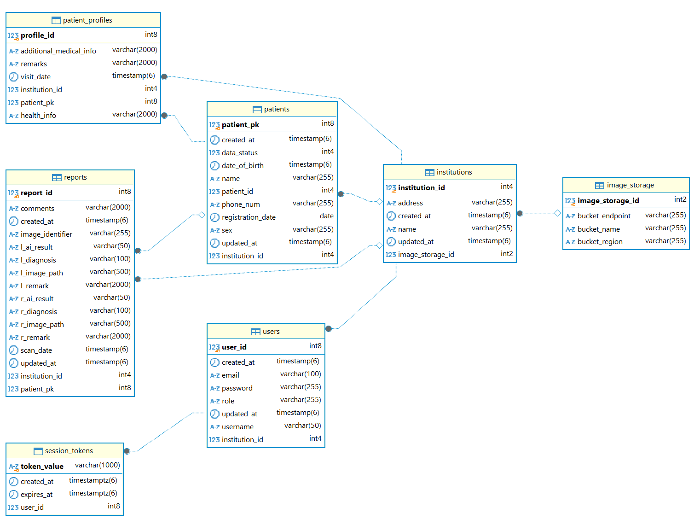

# 데이터베이스

이 문서에서는 CataScan 웹 어드민의 데이터베이스 구조와 관리 방법에 대해 설명합니다.
### 1. 소개
#### 1.1 목적
해당 문서는 Catascan Web Admin API에서 사용하는 DB 설계에 대한 개요를 제공한다. 이 문서는 ERD, 각 테이블 및 테이블 칼럼, 관계 및 제약사항 설명한다. 이 문서는 이해관계자(개발자, DB 관리자 등)가 스키마를 유지보수할 수 있도록 하는데 그 목적이 있다. 

### 1.2 범위
이 문서는 주요 테이블 및 그 칼럼, 테이블간 관계 및 제약사항과 설계 관련 고려사항을 설명한다. 

## 2. ER 다이어그램

## 3. 테이블 및 속성
### 3.1 사용자
- 테이블명: users 
- 목적: 웹 어드민 사용자의 사용자 정보 저장 및 인증 확인

| 칼럼(속성) | 데이터타입 | 제약사항 | 설명 |
|:--------------: |:--------------:|:--------------:|:--------------:|
| user_id | int8    | Primary Key, Auto increment    | 사용자 테이블의 기본키|
| username | varchar(50) | Unique | 로그인하는 사용자 ID|
| password | varchar(255) | NOT NULL | 로그인하는 사용자 암호(암호화된 정보)|
| email | varchar(255) | NULL | 사용자 이메일 |
| role | varchar(255) |  | 사용자 역할(기본 사용자는 user) |
| created_at | timestamp(6) | NOT NULL | 사용자 정보 생성시간 |
| updated_at | timestamp(6) | NOT NULL | 사용자 정보 최종수정시간 |
| institution_id | int4 | Foreign Key(institutions.institution_id) | 사용자와 연결된 기관 |

- 비고 : user_id는 기본키이고 username은 고유키로 사용자 생성시 고유성을 확인하여 사용자가 생성됩니다. 로그인 사용자에 따라 해당되는 기관 소속으로 정보를 저장하게 됩니다. 이 테이블을 N대1 관계로 기관(institution)테이블과 연결되어 있습니다. 

### 3.2 세션토큰
- 테이블명: session_tokens 
- 목적: 웹 어드민 사용자의 사용자 Paseto 토큰 저장 및 인증 확인

| 칼럼(속성) | 데이터타입 | 제약사항 | 설명 |
|:--------------: |:--------------:|:--------------:|:--------------:|
| token_value | varchar(1000)    | Primary Key    | 세션 토큰이자 기본키 |
| user_id | varchar(50) | Foreign Key(users.user_id) | 세션 토큰과 연결된 사용자 |
| created_at | timestamptz(6) | NOT NULL | 토큰 생성시간 |
| expires_at | timestamptz(6) | NOT NULL | 토큰 만료시간 |

- 비고 : token_value는 그 자체로 고유한 기본키이고 사용자 로그인시 생성되고 만료되면 스케쥴러에 따라 삭제되거나 로그아웃시 삭제됩니다. 이 테이블을 N대1 관계로 사용자(users)테이블과 연결되어 있습니다. 

### 3.3 기관
- 테이블명: institutions 
- 목적: 웹 어드민 사용자의 기관 정보

| 칼럼(속성) | 데이터타입 | 제약사항 | 설명 |
|:--------------: |:--------------:|:--------------:|:--------------:|
| institution_id | int4    | Primary Key, Auto increment    | 기관 테이블의 기본키|
| name | varchar(255) | NOT NULL | 기관명 |
| address | varchar(255) | NULL | 기관 주소 |
| created_at | timestamp(6) | NOT NULL | 기관 정보 생성시간 |
| updated_at | timestamp(6) | NOT NULL | 기관 정보 최종수정시간 |

- 비고 : institution_id는 기본키이고 사용자 생성에 맞춰 기관이 생성됩니다. 기관명이 동일한 경우는 없고, 기관명을 동일하게 해서 사용자 정보를 생성할 경우, 같은 기관 소속의 사용자를 생성하게 됩니다. 이 테이블을 1대N 관계로 사용자(users)테이블, 눈 리포트(report)테이블, 환자(patient)테이블, 환자프로필(patient_profiles)테이블과 연결되어 있습니다. 

### 3.4 환자
- 테이블명: patients 
- 목적: 환자 기본 정보 저장 및 관리

| 칼럼(속성) | 데이터타입 | 제약사항 | 설명 |
|:--------------: |:--------------:|:--------------:|:--------------:|
| patient_pk | int8 | Primary Key, Auto increment | 환자 테이블의 기본키|
| patient_id | int4 | NOT NULL | 기관내 식별가능한 환자 ID |
| name | varchar(255) | NOT NULL | 환자명 |
| sex | varchar(10) | NOT NULL | 환자성별(male, female, other) |
| date_of_birth | timestamp(6) | NOT NULL | 환자생년월일 |
| data_status | int4 | DEFAULT 1 | 환자 정보 삭제여부(0은 삭제된 환자) |
| phone_num | varchar(255) | NULL | 환자 연락처 |
| registration_date | date |  | 환자 정보 등록일 |
| created_at | timestamp(6) | NOT NULL | 환자 정보 생성시간 |
| updated_at | timestamp(6) | NOT NULL | 환자 정보 최종수정시간 |
| institution_id | int4 | Foreign Key(institutions.institution_id) | 환자와 연결된 기관 |

- 비고 : patient_pk는 기본키이고 기관별로 patient_id는 고유한 번호를 두고 환자 정보가 생성됩니다. 이 테이블을 N대1 관계로 기관(institution)테이블과 연결되어 있습니다. 환자 정보 완전 삭제는 관리자를 통하거나, 스케쥴러에 따라 사용자가 삭제한지 일정 기간 경과한 환자를 삭제합니다.

### 3.5 환자프로필
- 테이블명: patient_profiles
- 목적: 환자 건강 관련 프로필 정보 저장 및 관리

| 칼럼(속성) | 데이터타입 | 제약사항 | 설명 |
|:--------------: |:--------------:|:--------------:|:--------------:|
| profile_id | int8    | Primary Key, Auto increment | 환자 테이블의 기본키|
| additional_medical_info | varchar(2000) |  | 환자 건강 관련 정보(JSON 형식) |
| remarks | varchar(2000) | | 환자 프로필 관련 비고란 |
| visit_date | timestamp(6) |  | 방문일자 |
| institution_id | int4 | Foreign Key(institutions.institution_id) | 환자프로필과 연결된 기관 |
| patient_pk | int8 | Foreign Key(patients.patient_pk) | 환자프로필과 연결된 환자 |

- 비고 : profile_id는 기본키이고 기관별로 patient_id는 고유한 번호를 두고 환자 정보가 생성됩니다. additional_medical_info는 cataract, diabetes, hypertension 여부, 혹은 아예 모를 경우 dontKnow, systolicBp, diastolicBp, rightEyeVision, leftEyeVision, bloodSugarLevel, visitDate 의 정보를 JSON형태로 저장하고 있습니다.  테이블을 N대1 관계로 기관(institution)테이블, 환자(patients)테이블과 연결되어 있습니다. 환자가 삭제되면 같이 삭제됩니다. 

### 3.6 눈 리포트
- 테이블명: reports
- 목적: 눈 관련 정보 저장 및 관리

| 칼럼(속성) | 데이터타입 | 제약사항 | 설명 |
|:--------------: |:--------------:|:--------------:|:--------------:|
| report_id | int8    | Primary Key, Auto increment | 리포트 테이블의 기본키|
| image_identifier | varchar(255) | NOT NULL | 앱에서 등록시 식별가능하도록 생성하는 정보('이름=성별' 형태, 예시) 'john doe=m') |
| comments | varchar(2000) | NULL | 리포트 관련 비고 |
| l_ai_result | varchar(50) | NOT NULL | 왼쪽 눈 모델 결과 |
| r_ai_result | varchar(50) | NOT NULL | 오른쪽 눈 모델 결과 |
| l_diagnosis | varchar(100) |  | 왼쪽 눈 진단 결과 |
| r_diagnosis | varchar(100) |  | 오른쪽 눈 진단 결과 |
| l_remark | varchar(2000) |  | 왼쪽 눈 관련 비고 |
| r_remark | varchar(2000) |  | 오른쪽 눈 관련 비고 |
| l_image_path | varchar(500) |  | 왼쪽 눈 이미지 경로 |
| r_image_path | varchar(500) |  | 오른쪽 눈 이미지 경로 |
| scan_date | timestamp(6) |  | 눈 촬영일 |
| created_at | timestamp(6) | NOT NULL | 리포트 정보 생성시간 |
| updated_at | timestamp(6) | NOT NULL | 리포트 정보 최종수정시간 |
| institution_id | int4 | Foreign Key(institutions.institution_id) | 리포트와 연결된 기관 |
| patient_pk | int8 | Foreign Key(patients.patient_pk), Nullable | 리포트와 연결된 환자 |

- 비고 : report_id는 기본키이고 이 리포트는 기본적으로 모바일 앱에서 생성합니다. ai_result는 lowRisk, requiresAttention, ungradable 중 하나의 결과를 저장하고, diagnosis는 certainlyNormal, probablyNormal, uncertain, probablyCataract, certainlyCataract 중 하나의 결과를 저장합니다. 이미지 경로는 URL로 해당 링크에 따라 이미지를 불러올 수 있습니다. 리포트는 환자와 연결되기 전에 patient_pk가 null값을 가질 수 있습니다. 이 테이블을 N대1 관계로 기관(institution)테이블, 환자(patients)테이블과 연결되어 있습니다. 

## 4. 관계
#### 4.1 institutions ↔ users

1대N관계: 한 기관은 여러 사용자를 둘 수 있습니다. 
users.institution_id가 institution.institution_id를 외래키로 참조합니다. 

#### 4.2 users ↔ session_tokens

1대N관계: 한 사용자는 여러 세션토큰을 생성할 수 있습니다.
session_tokens.user_id가 users.user_id를 외래키로 참조합니다. 

#### 4.3 institutions ↔ patients

1대N관계: 한 기관에 여러 환자가 있습니다. 
patients.institution_id가 institution.institution_id를 외래키로 참조합니다. 

#### 4.4 institutions ↔ patient_profiles

1대N관계: 한 기관에 여러 환자 프로필이 있습니다. 
patient_profiles.institution_id가 institution.institution_id를 외래키로 참조합니다. 

#### 4.5 institutions ↔ reports

1대N관계: 한 기관에 여러 눈 리포트가 있습니다. 
reports.institution_id가 institution.institution_id를 외래키로 참조합니다. 

#### 4.6 patients ↔ patient_profiles

1대N관계: 한 환자는 여러 환자 프로필을 둘 수 있습니다. 
patient_profiles.patient_pk가 patients.patient_pk를 외래키로 참조합니다. 

#### 4.7 patients ↔ reports

1대N관계: 한 환자는 여러 눈 리포트를 둘 수 있습니다. 
reports.patient_pk가 patients.patient_pk를 외래키로 참조합니다. 

## 5. 제약사항 및 비즈니스 규칙
#### 기본 키:
각 테이블은 단일 컬럼을 기본 키로 설정하여 레코드를 고유 식별합니다.

#### 외래키:

* users.institution_id → institution.institution_id
* session_tokens.user_id → users.user_id
* patients.institution_id → institution.institution_id
* patient_profiles.institution_id → institution.institution_id
* reports.institution_id → institution.institution_id
* patient_profiles.patient_pk → patients.patient_pk
* reports.patient_pk → patients.patient_pk

#### 고유값 제약:

users.username은 유일한 값입니다. 
institutions.name은 중복되지 않습니다. 

#### Not Null:

일부 필드(first_name, last_name, order_date, name, price 등)는 NOT NULL로 지정하여 데이터 무결성을 보장합니다.

#### 기본값:

모든 테이블의 created_at는 current_timestamp가 기본값입니다.
patients.data_status는 기본값이 1입니다. 

## 6. 인덱스(Index)
기본키 인덱스: RDB에서는 자동적으로 기본키 칼럼에 대해서는 자동적으로 인덱스를 생성합니다. 
외래키 인덱스: 보편적으로 외래키는 조인 속도를 향상 시키는 목적으로 인덱스를 추가합니다. 

추가 인덱스:
institution.name이나 patient.name을 인덱스로 추가하여 검색 속도를 향상시킬 수 있습니다. 

## 7. 설계의도
확장성:
환자 데이터와 환자 프로필 데이터를 분리한 이유는 환자 프로필 데이터는 방문시마다 추가할 수 있도록 하기 위함입니다. 지금은 환자 데이터가 생성될 때 환자 프로필 하나가 생성되어 해당 프로필을 수정하는 방식입니다. 환자 프로필 내 additional_medical_info는 필요한 관련 정보를 추가로 저장할 수 있도록 하기 위해 항목별로 칼럼을 생성하기보다는 해당 데이터를 JSON 형태로 저장하였습니다. 

데이터 정합성:
테이블에 기관 및 환자 외래키를 사용한 이유는 데이터가 일관성을 유지하도록 하기 위합입니다. (예를 들어 모든 환자, 리포트는 특정 기관에 소속되도록 하거나 한 환자는 프로필을 가지게 된다.)

인증: 
세션토큰을 테이블로 저장하여 관리할 수 있도록 하였습니다. 이후에 변형해서 로그인된 사용자가 하나만 되도록 관리할 수 있습니다. 

## 8. 결론
이 문서는 Catascan Web Admin을 위한 데이터베이스 스키마 설계를 설명합니다. 주요 테이블, 컬럼, 관계 및 제약사항을 명시함으로써 데이터 무결성을 확보하면서 확장성과 유지보수성을 갖춘 구조를 마련할 수 있습니다. 추후 개발 및 운영 과정에서 이 문서를 참고하여 DB를 유지・관리하면 시스템 안정성 및 성능을 높이는 데 도움이 될 것입니다.

[처음으로](../overview.md) | 
[소개로](00_introduction.md) | 
[이전: API](03_api.md) | 
[다음: 사용자 가이드](05_user_guide.md) 
